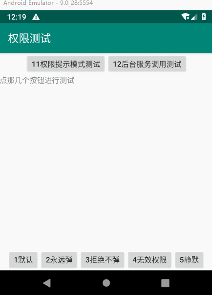

# :open_book:Android-UsesPermission

安卓权限申请封装处理框架。测试支持4.0+。项目源于正式处理Android权限问题时，没找到简单、能满足被拒绝权限自动会到系统设置处理的框架，按自己的编程习惯造一个熟悉的轮子还是蛮好的。第一次使用Android Studio，还是Eclipse敲代码爽。来自一个（独爱HTML+CSS来构建用户界面的）Android很早入门的新手。

项目用到了[`XXPermissions`](https://github.com/getActivity/XXPermissions)中的权限列表、国产手机权限设置页面跳转列表，借鉴了其中的权限结果`onRequestPermissionsResult`的接收方式。

类库源码在[lib_comm/src/.../permission](lib_comm/src/main/java/ecomm/lib_comm/permission)文件夹中，没几个文件，直接复制到你的程序里面即可使用。


## 特性

1. 一个函数调用处理权限申请的所有问题，被拒绝的权限重复询问，被永久拒绝的权限（记住选择、不再询问）打开App授权系统设置。
2. 函数式调用，代码简洁明晰，阅读源码不用跳来跳去；额外支持仅需编写一遍代码，`请求用户权限`和`检测是否授权(不调起用户请求)`共用相同处理逻辑，如在后台服务中，存在`Activity`时会弹请求，不存在时仅仅检测权限。
3. 明确的授权结果回调，要么有(True)，要么没有(False)。
4. 默认0界面，调用者无需知道、提供、导入任何界面包括文件，但可深度定制。
5. 中性，默认非弓虽J式、有回旋余地的对待拒绝权限的场景。
6. 理论上支持任何Android版本（但仅在 4.0 - 9.0 模拟器上进行了测试）。

## 演示

可直接编译`test_app`项目进行测试，或者下载`assets/test_app-debug-xxx.apk`测试安装包。




## 快速使用

直接复制[lib_comm/src/main/java/ecomm/lib_comm/permission](lib_comm/src/main/java/ecomm/lib_comm/permission)里面的文件到你的程序里面即可使用。

### 示例代码
``` java
//假设需要获取摄像头、录音权限，直接在调用的地方实现抽象类，调用逻辑能简单直观不少

new UsesPermission(MainActivity.this, Permission.CAMERA, Permission.RECORD_AUDIO){
    @Override
    protected void onTrue(@NonNull ArrayList<String> lowerPermissions) {
        //获取了全部权限执后行此函数，
    }

    @Override
    protected void onFalse(@NonNull ArrayList<String> rejectFinalPermissions, @NonNull ArrayList<String> rejectPermissions, @NonNull ArrayList<String> invalidPermissions) {
        //未全部授权时执行此函数
    }

    //要么实现上面两个方法即可，onTrue或onFalse只会有一个会被调用一次
    //要么仅仅实现下面这个方法，不管授权了几个权限都会调用一次

    @Override
    protected void onComplete(@NonNull ArrayList<String> resolvePermissions, @NonNull ArrayList<String> lowerPermissions, @NonNull ArrayList<String> rejectFinalPermissions, @NonNull ArrayList<String> rejectPermissions, @NonNull ArrayList<String> invalidPermissions) {
        //完成回调，可能全部已授权、全部未授权、或者部分已授权
        //通过resolvePermissions.contains(Permission.XXX)来判断权限是否已授权
    }
};
```

### 默认行为逻辑

#### 请求用户权限

1. 先直接发起权限申请
    - 普通权限（没永久拒绝的权限）如果被拒绝（非永久拒绝），后续会安排再弹框申请一次(防用户误选)。
    - 如果授权结果有被永久拒绝的，这部分权限会和第二步权限申请一起弹框跳转到App授权系统设置。
2. 弹一次框处理被永久拒绝的权限(弹一次够了)，跳转到App授权系统设置界面。
3. 如果全部已授权，直接回调结果，什么界面也不会弹。

可参考重写`onTips`方法修改此行为，做到不弹提示或者多次弹提示授权。请求用户权限必须提供`Activity`。

#### 检测用户权限

- 如果纯粹的想检测一下权限是否授权，调用时只需不提供`Activity`参数即可，检测结果会回调返回（同步的）。
- 如果提供`Activity`参数，但不确定`Activity`存不存在：`Activity`为`null`时，逻辑同上面这条；`Activity`不为`null`时，逻辑同`请求用户权限`。


# :open_book:UsesPermission类文档
`import ecomm.lib_comm.permission.UsesPermission;`

这个类对外只有一个构造函数，直接`new`直接调起授权请求。使用过程中只需重写这个类的相应函数来控制授权请求行为。无多余、也不提供对外控制的方法。

## 构造函数
### UsesPermission(activity,permissions,defaultTips="")
调用构造函数立即会调起授权请求，对`permissions`列表中的权限进行申请。

请求过程中会根据`onTips`返回的结果来控制提示信息、和授权请求流程，`defaultTips`是`onTips`默认实现使用到的提示信息默认值，默认为""字符串；具体逻辑参考`onTips`。

### UsesPermission(activity,context,permissions,defaultTips="")
检测用户权限、请求用户权限 共用逻辑的构造函数，对比上面这个构造函数只是多了`context`参数。

如果`activity`为`null`时，`context`可以是`ApplicationContext`等，仅仅检测用户权限，不会发起用户权限请求。明确的传入`null`值即可当做权限检测函数来用。

如果`activity`不为`null`时，实际的执行过程同上面这个构造函数。

本方法的存在的意义在于：权限检测功能是次要的；主要用于 在有界面（`Activity`中调用）、无界面（`Service`之类中调用）中可共用一套代码逻辑（`Activity`可能存在也可能不存在，意思就是可能是`null`），但无需编写重复的代码，即可完成权限处理。不管有没有界面，没有就仅仅检测一下权限就回调了，有就发起用户权限请求，简单粗暴。


## 回调类可重写函数
这些函数都是可以选择重写，默认提供了空实现，不实现也没关系。

### void onTrue(lowerPermissions)
权限已全部授权时的回调，不管什么情况，`onTrue`和`onFalse`肯定有一个会回调。注意：方法内跟API版本有关的方法调用，应自行判断API版本，因为低版本API中高版本权限请求全部会放行。

`lowerPermissions`：如果是在低版本API上处理不支持的高版本新权限时，会忽略此项权限的检测的检测，默许放行，此时本参数将带上此权限。

### void onFalse(rejectFinalPermissions,rejectPermissions,invalidPermissions)
存在未授权权限时回调，不管什么情况，True和False肯定有一个会回调

`rejectFinalPermissions`：被永久拒绝的权限列表，为`rejectPermissions`的子集，空数组代表没有此项。

`rejectPermissions`：被拒绝的权限列表（空数组代表没有此项，是manifest未声明的权限）；不在这个列表里面的是已经授权了的部分权限，可用`contains`方法来判断。

`invalidPermissions`：未在`manifest`里声明的权限列表，不会出现在`rejectFinalPermissions`中，空数组代表没有此项。


### void onComplete(resolvePermissions,lowerPermissions,rejectFinalPermissions,rejectPermissions,invalidPermissions)
授权完成时回调，会在`onTrue`和`onFalse`之一回调后调用。

`resolvePermissions`：已授权的权限列表。

`lowerPermissions`：参考`onTrue`，为`resolvePermissions`的子集。

剩余参数参考`onFalse`。


## 控制类可重写函数
这些函数都是用来控制授权请求行为（仅仅用作权限检测时无效），都提供了默认实现。

### String onTips(viewTipsCount,permissions,isFinal)
整个类里面最核心，逻辑最复杂的一个方法（虽然默认实现只有3行代码）。此方法控制着整个权限请求的流程，弹不弹提示，尝不尝试重新申请，都是它说了算。

授权请求发起前会回调此方法，用来生成设置提示信息，也是来决定是否提示和进行授权。如果返回null，代表不进行下下一步操作；返回字符串会进行提示然后进行请求授权。注意：这个方法，会有不同权限进行多次调用；如果用户选点击了取消默认这些权限不会再调起请求（可重写`onCancelTips`修改此行为）。

默认行为为：
1. 先直接发起权限申请 `viewTipsCount=0`
      - 普通权限（非永久拒绝）如果被拒绝（非永久拒绝），后续会安排再弹框申请一次(防误选)。
      - 如果结果有被永久拒绝，这部分权限会和后面的永久权限申请一起弹框处理。
2. 弹一次框处理被永久拒绝的权限(弹一次够了)，跳转到App授权系统设置界面 `viewTipsCount=1+`

```
@param viewTipsCount 0-n 是第几次准备弹提示框。
         0：申请前的引导提示，返回null代表不弹提示，直接调起授权。
             注意：第0次包含所有权限(不含带自定义授权请求的权限)，无法区分是不是永久拒绝的权限。
         1+:被永久拒绝的权限申请，或普通权限上一轮被拒。
             注意：为1的时候，如果权限带自定义的授权请求方式，就算返回了null，也会进行提示并调用授权请求。

@param permissions 被拒绝的权限列表
@param isFinal 这个权限列表是不是永久被拒绝的权限，true是，false为未永久拒绝

@return 返回提示信息；返回值为null不进行申请；为空字符串时自动生成合理的提示。
     字符串内容支持特定占位符：
         {Auto}:用自动生成提示内容替换
         {Names}:自动替换被拒绝的权限名称
                如：'xx"{Names}"xx' => 'xx"权限名1,权限名2,权限名3"xx'
```

### String onCancelTips(viewCancelCount,permissions,isFinal)
**不建议重写，取消了也弹提示真不友好**，弹出了提示时，用户点击了取消时的额外提示信息。返回null彻底不再调起提示，默认就是返回null。这个回调的用法和`onTips`一模一样，只是这个仅仅作用在点击了取消时。注意：重写这个方法应该慎重，最多`viewCancelCount`几次后就返回`null`，避免出现无法取消永远弹框的问题。

`viewCancelCount` `1-n` 当前这次请求是第几次取消。


### String onTipsDialogView(tips,isCancel,viewTipsCount,permissions,isFinal,okCall,cancelCall)
授权提示弹框，重写此方法自定义弹框行为，默认使用系统`AlertDialog`弹框。只要求必须回调`okCall`，`cancelCall`中的任何一个，怎么显示界面、显示多少个界面 -> 随意。


# :open_book:Permission类文档
`import ecomm.lib_comm.permission.Permission;`

这个类封装了8.0版本的危险权限列表，并且提供了对应的权限名称映射。

## 权限列表
使用过程中推荐使用这个类里面定义的权限，比如`Permission.CAMERA`。如果用`Manifest.permission.CAMERA`也可以，他们是等价的。

## 静态方法
### String QueryName(permission)
查询权限对应的名称，比如`Permission.CAMERA`对应的名称为`相机`。

### String QueryNames(permissions)
获取权限名称列表，如`权限名1,权限名2,权限名3`，此方法用于方便的生成授权提示信息。


# :open_book:最佳实践

## 使用默认实现
不重写`onTips`即为默认实现。

请求授权时直接弹出请求，用户如果点了拒绝（非永久），后续还会弹一次提示，防止误点。如果有被永久拒绝的权限，会弹提示，转到系统设置。

## 授权前先提示
在调起授权前先弹提示，其他行为和默认实现一样。重写`onTips`方法：
``` java
@Override
protected String onTips(int viewTipsCount, @NonNull ArrayList<String> permissions, boolean isFinal) {
    if(viewTipsCount<=1) {
        return "";
    }
    return null;
}
```

## 不授权永远弹提示
如果不授权功能是没法使用的场景，可以一直弹提示，直到用户点击了取消为止（可重写`onCancelTips`让无法取消，但不建议）。重写`onTips`方法：
``` java
protected String onTips(int viewTipsCount, @NonNull ArrayList<String> permissions, boolean isFinal) {
    if(viewTipsCount>0) {//如果需要授权调起前先提醒，直接把这个if去掉就行了
        return "";
    }
    return null;
}
```

## 静默方式授权
如果权限被拒绝，不弹任何提示，也不跳转权限系统设置界面。仅仅用来调起授权请求。但对于需要引导才能进行权限设置的除外(如安装、悬浮窗权限)。重写`onTips`方法：
``` java
protected String onTips(int viewTipsCount, @NonNull ArrayList<String> permissions, boolean isFinal) {
    return null;
}
```

## 仅仅检测是否已授权
仅仅检测权限是否已授权，只需提供任意`Context`，无需提供`Activity`
``` java
Activity activity=null;//可以为null：仅仅检测权限，可以不为null：发起用户权限请求
Context context=applicationContext;

new UsesPermission(activity, context, Permission.READ_CONTACTS){
    ......
};
```

## 自定义提示界面
默认实现在弹提示的时候使用的是系统`AlertDialog`弹框，可重写`onTipsDialogView`方法来使用自己的提示界面。比如[`HiPermission`](https://github.com/yewei02538/HiPermission)的这种蛮美观友好的界面：


这个库不提供界面实现，需要自行实现。


## 更多实现
参考`test_app`目录中的`MainActivity`，里面有已实现的代码。


# :star:捐赠
如果这个库有帮助到您，请 Star 一下。

你也可以选择使用支付宝、微信给我捐赠：

  
